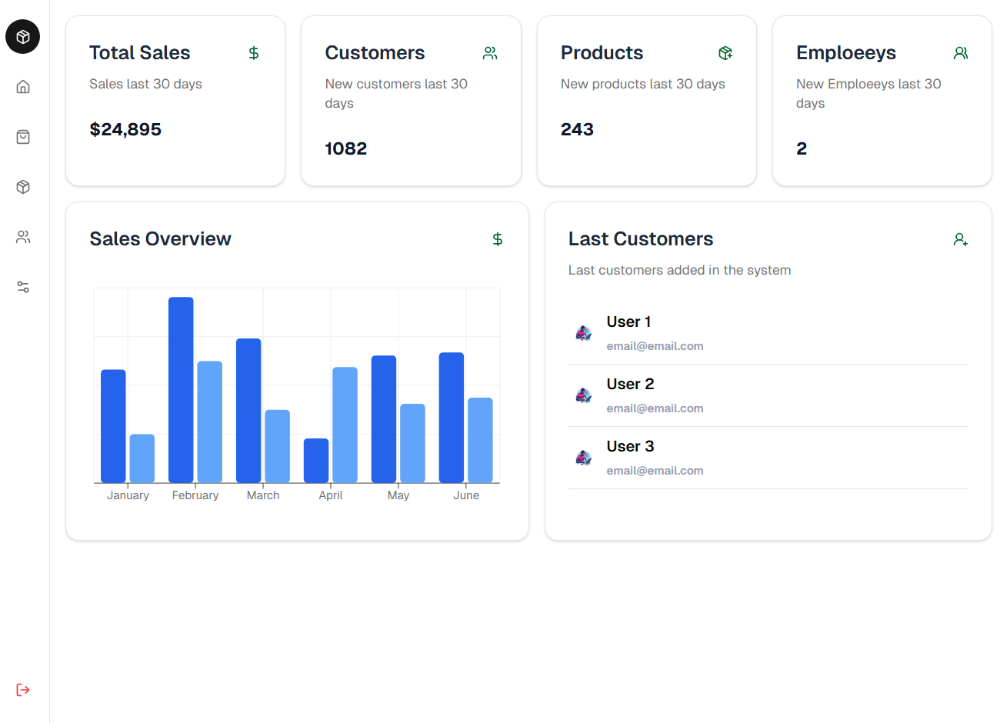

# Dashboard UI – Next.js & shadcn/ui

A simple and responsive dashboard UI built to practice **Next.js**, **shadcn/ui**, and component-based layouts.

## Features
- Dashboard metric cards
- Overview chart
- Responsive layout (desktop & mobile)
- Clean and reusable UI components

## Tech Stack
- Next.js
- React
- shadcn/ui
- Tailwind CSS


## Getting Started

### Run Locally

Clone the repository:
```bash
git clone https://github.com/alesk1v9/DashboardUI-NextJs-and-ShadcnUI.git

cd DashboardUI-NextJs-and-ShadcnUI

npm install

npm run dev
## Screenshots


